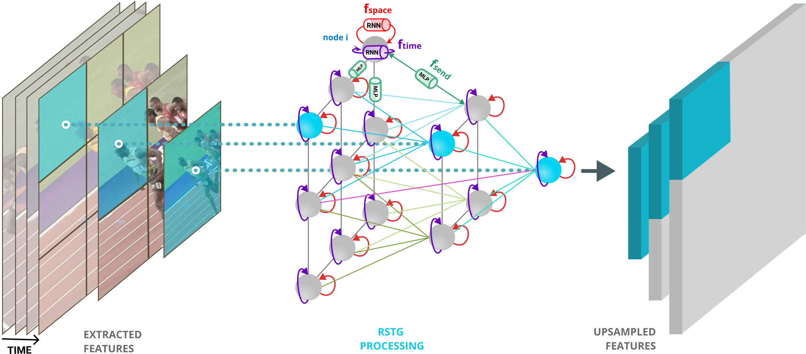

# Recurrent Space-time Graph Neural Networks - RSTG 

This is the Tensorflow implementation of the RSTG model described in our paper [Recurrent Space-time Graph Neural Networks](https://arxiv.org/abs/1904.05582)

<div align="center">
  
</div>


## Citation
Please use the following BibTeX in case you use this repository in your work.
```
@incollection{rstg_2019,
title = {Recurrent Space-time Graph Neural Networks},
author = {Nicolicioiu, Andrei and Duta, Iulia and Leordeanu, Marius},
booktitle = {Advances in Neural Information Processing Systems 31},
year = {2019}
}
```
## Overview

The repository contains the implementation of the RSTG model and our Tensorflow implementation of Non-Local, I3D, C2D models used as backbones. 

 - `models/graph_model/` code for our RSTG model
 - `models/backbone_models/` code for SimpleConv, C2D, I3D, and Non-Local backbones
 - `create_datasets/` code for extractivg the dataset in the format used by us
 - `configs/` configuration files for our provided models
 - `scripts/` scripts for starting the training / evaluation or for dataset creation
 - `train.py` main function for training and evaluating a model 
 

## Installation
Create a Conda enviroment with the following configuration:
 - python                    3.6.8
 - tensorflow-gpu            1.13.1
 ... 

## Checkpoints for pre-trained models

You can find [here](https://drive.google.com/drive/folders/16sWXp4P7wqubFL7BcUyMExhsKPywk9Ol?usp=sharing) some checkpoint described in our paper, trained on Something-Something dataset with Kinetics pre-training.

Please put the checkpoints in `./checkpoints/`


## Something-Something Dataset

1. Download [Something-Something-v1](https://20bn.com/datasets/something-something/v1) dataset and extract it in ./datasets/
2. Run

```Shell
mkdir datasets
./scripts/create_smt-smt_dataset_train.sh
./scripts/create_smt-smt_dataset_valid.sh
```
Optionally: create validation dataset containing multiple clips per video for dense evaluation.

```Shell
./scripts/create_smt-smt_dataset_valid_multiclips.sh
```

## SyncMNIST Dataset
Run

```Shell
mkdir datasets
./scripts/create_syncMNIST.sh
./scripts/create_syncMNIST_test.sh
```
 
## Something - Something Checkpoints

We provide checkpoints for the models trained on Something-Something-v1, as described in our paper, initialized from I3D or C2D models pretrained on Kinetics.

We also give Tensorflow checkpoints for I3D and C2D models trained on Kinetics from [Non-Local](https://github.com/facebookresearch/video-nonlocal-net/blob/master/README.md) repository.


| <sub>Model</sub> | <sub>Config File</sub> | <sub>Checkpoint</sub> | 
| ------------- | ------------- | ------------- |
| c2d_kinetics | config_kinetics_c2d.yaml | [`ckpt`](https://drive.google.com/open?id=1Fx61I_tNLpSjR88cKHToHbLss8FVdGqW) |
| i3d_kinetics | config_kinetics_i3d.yaml | [`ckpt`](https://drive.google.com/open?id=1C9ri6QDhoSQwXMMxe-TDbkKAhz1iJ-nB) |


| Model| <sub>Config File</sub> | <sub>Checkpoint</sub> | 
| ------------- | ------------- | ------------- |
| c2d | config_smt_c2d.yaml | [`ckpt`](https://drive.google.com/open?id=1-0S41Su4Z3ocPHqIj9n7zWeR0MROC5lh)|
| c2d_rstg | config_smt_c2d_rstg_final.yaml | [`ckpt`](https://drive.google.com/open?id=1pXpo-pRetPP0iO-_vFg8IJ2aR2QY-D-m)|
| i3d | config_smt_i3d.yaml | [`ckpt`](https://drive.google.com/open?id=1b4J1it-fq3gz5V0QB41zRhYD4hBLJnvY)|
| non-local</sub> | config_smt_nonlocal.yaml | [`ckpt`](https://drive.google.com/open?id=1UgpBLj_R2AlLcZk3MNmkCSXMV5JaP9Cz)|
| i3d_rstg_final | config_smt_i3d_rstg_final.yaml | [`ckpt`](https://drive.google.com/open?id=1c5u0x10T-LZB1_FCRAvRk5n7lFxCzRh0)|
| i3d_rstg_res3_res4 | config_smt_i3d_rstg_res3_res4.yaml | [`ckpt`](https://drive.google.com/open?id=1bTSTrZNcMeskDv8kQ1eclKnab7tZUw_z)|

Download the desired model in `./checkpoints/` and use the appropiate configuration file from `./config/` in order to evaluate it, by setting --config_file in `./scripts/run_smt-smt.sh`.

## Train

You can fine-tune from the backbones pretrained on Kinetics or you can start from scratch by setting the --restore flag in your config file.

```Shell
# 1. create a config file similar to the ones in ./configs/ for your desired model
# 2. make sure you have the flag --mode=train
# 3. give the path to the config file to the script ./scripts/run_smt-smt.sh (-config_file)
./scripts/run_smt-smt.sh new_model_name
# the model will be saved in ./checkpoints/
```

## Evaluate

We evaluate the models in two manners. In the first one, we evaluate a central 224x224 crop for each video. In the second one we extract N=11 256x256 crops uniformly sampled on the width of the frames for covering the entire spatial size of the video, and use 2 samplings along the time dimension, resulting in 2N = 22 clips. The final prediction is the average of the clips predictions.

Evaluate one clips.
```Shell
# 1. create a config file similar to the ones in ./configs/ for your desired model
# 2. put the path to the evaluated model in the config file (--restore_dir) and --restore=True
# 3. make sure you have the flag --mode=eval
# 4. give the path to the config file to the script ./scripts/run_smt-smt.sh (--config_file)
./scripts/run_smt-smt.sh new_model_name
```

Evaluate multiple clips. 
Use a config file containing --num_eval_spatial_clips :  11, --num_eval_temporal_clips :  2 and --test_dataset pointing to the appropiate path.

```Shell
# 1. create a config file similar to the ones in ./configs/config_smt_dense_i3d_rstg_final.yaml for your desired model
# 2. put the path to the evaluated model in the config file (--restore_dir) and --restore=True
# 3. make sure you have the flag --mode=eval
# 4. give the path to the config file to the script ./scripts/run_smt-smt.sh (--config_file)
./scripts/run_smt-smt.sh new_model_name
```
